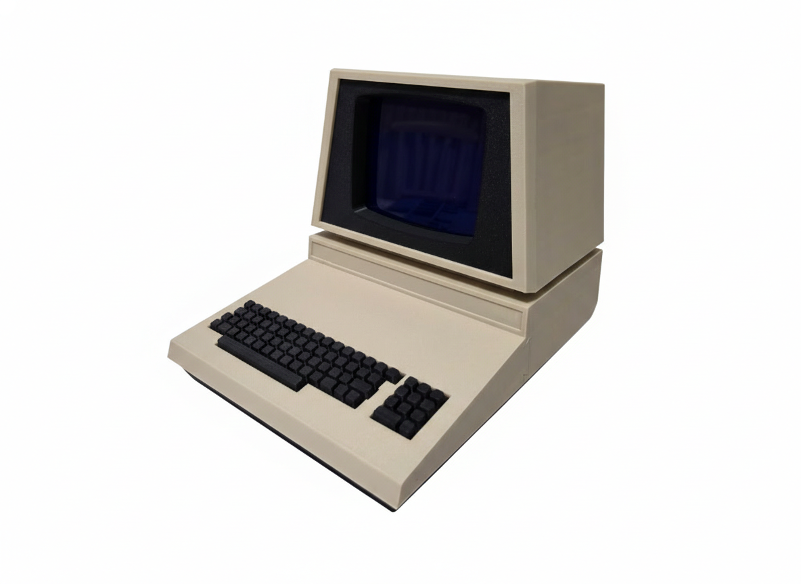
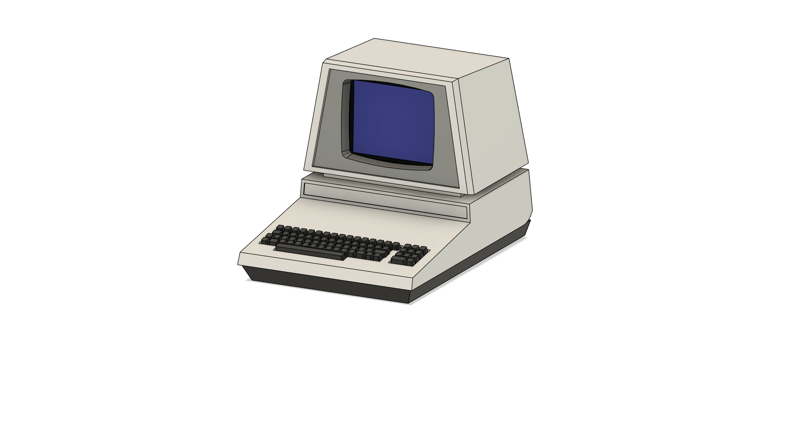
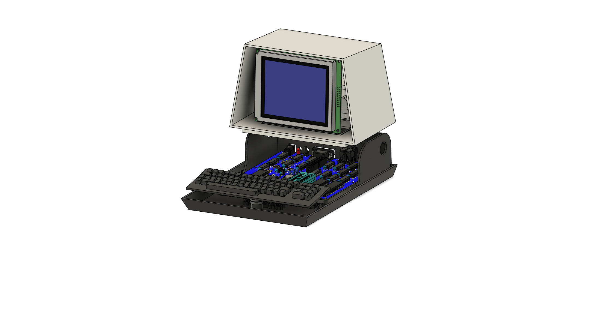
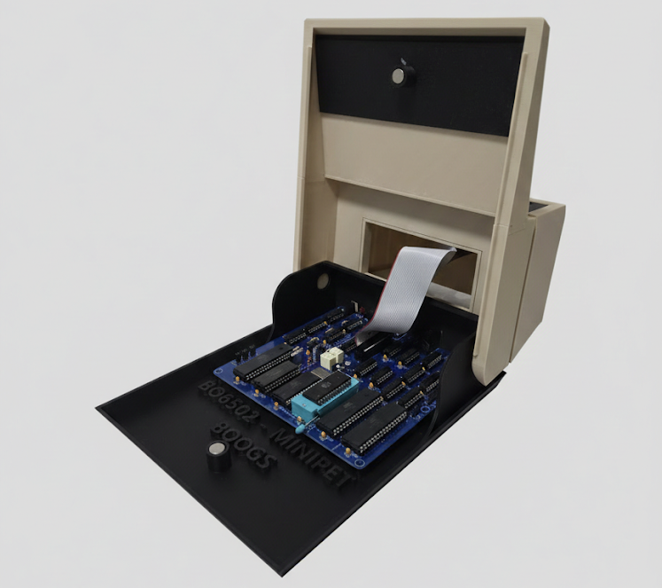

# Boogs77-miniPET: 65C02-Based Retro Computer

The **Boogs77-miniPET** is a compact, high-performance 8-bit computer inspired by the iconic Commodore PET aesthetics. Built around the **W65C02S** processor, this project utilizes the modular architecture of the [BO6502 System](https://github.com/Boogs77/BO6502_65C02-based_modular_computer) and integrates it into a custom-designed, 3D-printed enclosure.

---

## 🧠 System Architecture & Modules

The internal logic of the miniPET is derived directly from the modular boards of the BO6502 project. Each core component follows the same electrical and logical specifications:

### ⚙️ Core Processing Unit (CPU, RAM, ROM)
The system's "brain" and memory management are based on the high-reliability design of the BO6502:
* **CPU:** Western Design Center **W65C02S**, allowing for modern high-speed operation while maintaining full 6502 compatibility. Reference: [BO6502 CPU](https://github.com/Boogs77/BO6502_65C02-based_modular_computer/tree/main/BO6502%20CPU).
* **Clock:** System operates with a stable **1MHz** clock frequency. Reference: [BO6502 Reset/Clock Module](https://github.com/Boogs77/BO6502_65C02-based_modular_computer/tree/main/BO6502%20RESET).

### 🗺️ Memory Map
The memory layout is organized to ensure compatibility with the system firmware and modular hardware:
* **RAM (32KB):** Mapped from **$0000** to **$7FFF**. Reference: [BO6502 RAM](https://github.com/Boogs77/BO6502_65C02-based_modular_computer/tree/main/BO6502%20RAM).
* **ROM (32KB):** Mapped from **$8000** to **$FFFF**. Reference: [BO6502 ROM](https://github.com/Boogs77/BO6502_65C02-based_modular_computer/tree/main/BO6502%20ROM).

### 📟 Display Interface (BIGLCD)
The visual output is handled by the **BIGLCD** module. 
* **Addressing:** The module is mapped and accessible at memory address **$D19X**.
* **Reference:** [BO6502 BIGLCD](https://github.com/Boogs77/BO6502_65C02-based_modular_computer/tree/main/BO6502%20BIGLCD).

### ⌨️ Keyboard Input
Input is managed via a dedicated matrix keyboard interface.
* **Addressing:** The keyboard is mapped and accessible at memory address **$D18X**.
* **Reference:** [BO6502 KeyBoard Module](https://github.com/Boogs77/BO6502_65C02-based_modular_computer/tree/main/BO6502%20KEYb).

### 🔌 Serial Communication
Asynchronous communication is provided for external terminal access.
* **Addressing:** Accessible at the **$CXXX** memory range.
* **Reference:** [BO6502 Serial Module](https://github.com/Boogs77/BO6502_65C02-based_modular_computer/tree/main/BO6502%20SERIAL).

---

## 🏗️ Enclosure & 3D Design

One of the most distinctive features of this project is its custom case, modified using **Autodesk Fusion 360** from the original design at [commodorepetmini.com](https://commodorepetmini.com/). The case was printed on an **Anycubic Kobra S1**.

  
  

---

## 📋 Bill of Materials (BOM)

| Component | Description | Quantity |
| :--- | :--- | :--- |
| **W65C02S** | CMOS 8-bit Microprocessor | 1 |
| **AS6C62256** | 32K x 8 Static RAM | 1 |
| **AT28C256** | 32K x 8 EEPROM | 1 |
| **W65C22 (VIA)** | Versatile Interface Adapter | 2 |
| **NE555** | Precision Timer (Reset Circuit) | 1 |
| **BIGLCD** | High Contrast LCD Module | 1 |

👉 **[View Full BOM for Components](https://github.com/Boogs77/Boogs77-miniPET_65c02/blob/main/export/miniPET_bom.md)**

---

## 🔗 Useful PCB Links

To replicate this build, the following PCB layouts are required:
* [Main System Logic (CPU/RAM/ROM)](https://github.com/Boogs77/Boogs77-miniPET_65c02/tree/main/eagle)
* [KeyBoard Matrix PCB](https://github.com/Boogs77/BO6502_65C02-based_modular_computer/tree/main/BO6502%20KEYb)
* [BIGLCD Interface PCB](https://github.com/Boogs77/BO6502_65C02-based_modular_computer/tree/main/BO6502%20BIGLCD)

---

## 🖼️ Project Gallery

Internal assembly and detailed realization stages:

  
  

  
  

---
*Created by Boogs77 - 2026*